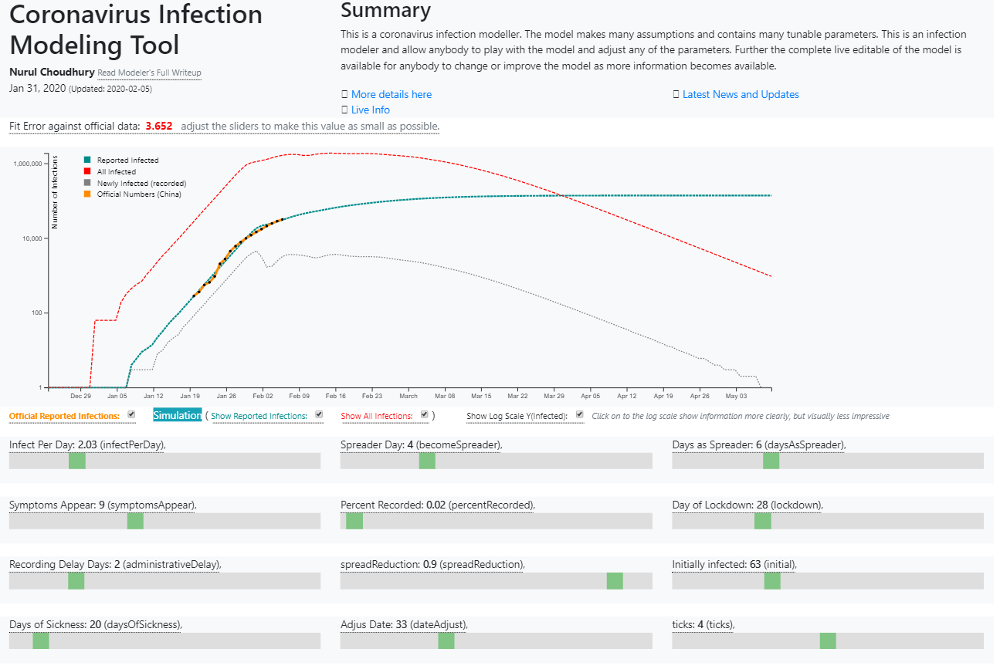

# CoronaVirus Modeling Tool
*Nurul Choudhury*  
*Jan 31, 2020*

## Summary
The coronavirus infection in Wuhan China is frightening but how bad is it really. This article describes a coronavirus infection modeling tool, that will describe how the model works. The model tries to answer some simple questions:

1. How bad is it going to get
2. When awill things start to stabalize
3. How effective was the lockdown of Wuhan city and Hubei province
4. We know how many people ar being reported to be infected (official), but how may people are really infected
5. How well does the model match the official numbers

The model makes many assumptions and contains many tunable parameters. The main purpose of the document is to understand the model details, give access to the model on a web page, and allow anybody to play with the model and adjust any of the parameters. Further the complete live editable of the model is available for anybody to change  or improve the model as more information becomes available. 

[Go to the modeling Tool](https://nurulc.github.io/coronavirus.html)

### The takeaway from the model:

1. The models parameters (there quite a few) were adjusted to track the reported numbers coming out of China.
2. Only 2% if the infected people are being reported. This is probably because only the very sick go to the hospital because they are so crowded. Because of insufficient testing kits only the most likely candidates are being tested. Finally only the people tested and found positive are being reported.
1. Once infected a person can spread the infection after 4 days but full symptoms do not show up until 9 days after the initial infection
1. An infected person spreads the infection for 6 days and at that point they are too sick to significantly spread to more people (they have already infected those who would be care givers)
1. The astonishing fact the model suggests that the real number of new infections originating from a single infected person is 2 per day for the 6 days they are active spreader - 12 people. This is not what we are hearing in the news but is was the only way to make all the numbers work with the data so far. This also reflect the observation from Germany where a woman went to a conference for 2 days and infected 4 people. Apperently she was not sick at all dering her time in Germany.
1. For the Wuhan lockdown to work, it has to be 96% effective for the pandemic to be brought under control, a back of the envelope calculation suggests that this may be possible. That means that after the lockdown one in fourty infected person is spreading it to one other person. This may sould like a lot but since most people are no longer meeting new people the virus spread is severly curtailed.
1. he total number of infected people (both reported and unreported) may well be close to 1 million as of today (Feb 3rd). 
1. THE GOOD NEWS the model suggests that thing should be under control by Feb 15th to 120th, and Wuhan quarantine can be lifted in mid March. 

### What can the model do

The model has a great number of options that you can try setting and look at the results. It allows you to perform what if analysis.
### Convayor Belt Model

Each new infection (person) moves along the desease progress conveyor. 

1. Become infected
2. Become spreader (infect others not already infected)
3. Serious symtoms appear
4. Stop spreading
5. Some of the infected are recorded by the authorities. 
6. Body fights back infector and all is well, or sadly the persone surcomes to the infection (death)

 
 
1. I have set those parameters to try and match as closely a possible the data from the model and the actual numbers coming out of China.
1. The recently published report in Lancet that suggests that there are 75,000 infections as of Jan 25th seems to correspond to the resulst from my model. 
1. If you do not believe those numbers you can adjust any of those oarameters.
1. Compare the real number of people infected (as produced by the simulation) and the reported number
   1. You can adjust those parameters to see the impact
2. Compare the official numbers against the numbers from the simulation
3. China has locked down Hubei/Wuhan the model let you see how effective is the lockdown
4. Alter the rate of spread of the infection
5. Adjust the lockdown date to see what inpact that would have on the results
6. The code is availabe (you have to know Javascript) as a jsfiddle.net so if you want you and alter the model

## Introduction

Unless you have been living under a rock you will be aware about the panic surrounding the Novel Coronavirus (2019-nCoV)  pandemic origination from Hubei province in China, and in particular originating in Wuhan, the capital city of Hubei. The city is in complete lockdown since Jan 23rd. This was done to contain the epidemic and prevent further spread of the virus throughout the rest of China and the world. I will not discuss much further details since this is very well documented by the news media and the internet.

The problem has been that we the public have so little information to really understand what is really happening. Is there a real global danger and will the Chinese authorities successfully contain the problem.   There appears to be a lot of fear, uncertainty, and doubt (FUD) that is making the whole world very nervous.  With the very little hard information we have, can we estimate the dangers ahead.

In order to try to shed some light, I set out to model the behavior of the epidemic. In order to create any sort of model we first need to lay out the facts that we know, or think we know. Further, we also need to make some simplifying assumptions. So here is what I believe we know along with some assumptions:

The source of the epidemic is believed to be at a large seafood and live animal market.

1. The initially infected people were directly infected at the market, but we do not know:
1. Model assumption, all initial infections occurred in one place a one point in time.
   1. How many people were infected? (a parameter in the model)
1. Over what period did the infection occur? (see assumption above)
1. Was it the only source of infection: 
   1. Only animal to human? NO
   1. From other locations? NO (model assumption)
1. At first it was thought that human to human transmission may not happen, but now we know the following:
   1. People to people transmission absolutely happens (Strong factual evidence)
   1. The transmission rate is very high: 
      1. What is the transmission rate? (a parameter in the model)
      1. Worse still the transmission happens before the symptoms appear
1. We do not know how soon after infection transmission can occur? (a parameter in the model)
1. It is thought the time from infectio n to visible symptoms is 9 days (a parameter in the model)
1. How long after full symptoms is an infected person a transmitter, since they are probably immobile and can only infect family members. Since family members are probably already infected, we assume a person with full symptoms stop being a transmitter after some short number of days (a parameter in the model).
1. Many believe that China is under reporting the number of infected individuals. This is highly likely, not because of nefarious reason, but because:
   1. It is reported that the hospitals in Wuhan and Hubei are so overwhelmed that staff have asked the public seek hospital treatment only if they are ‘almost dying’. 
Coronavirus is only being reported after confirmation test have verified it. We must estimate what percent of the infected population are going to the hospital and have been tested  (a parameter in the model).
We do not know how many days from the initial infection to full recovery (no longer able to transmit the disease). This too is a parameter in the model.

## The Model
The main objective of the model is to keep it as simple as possible while still providing useful and fairly accurate results. So many simplifying assumptions are made and they will be explained as to get to them.

The model core is an array of numbers, each cell represents a day from the start of the infection. 

1. The length of the array is the number of days from the start of the infection to the end. 
1. The value is each call is the number of people at that stage of the infection. 
1. The people is cell 0 are the ones initially infected.
   1. Each simulated day the vales of the cell is moved to the right (next cell index). 
1. The value in the last cell is dropped, i.e. the person no longer has the illness.
   1. Newly infected people are added to cell 0.
   1. The number of deaths are so small that the simplifying assumption the dead are left in the array.

## The stages of infection
Note: *a parameter is coloured in purple. These values can be adjusted to match known values (more of this will be explained later).*

1. Newly infected people - in cell 0
2. People in cell **becomeSpreader** - can transmit infection to others. This value is a parameter we can set.
3. The parameter **daysAsSpreader** for how many days the infected person can spread the infection to others. So all the people from cells **becomeSpreader** to (*becomeSpreader  + daysAsSpreader - 1*) can create new infections. This period is known as spread period. A person must be a spreader at least until they are at the visible symptoms (symptomsAppear) day. Although this restriction is not enforced in the model. 
4. The number of people each person in the spread period cells is given by the parameter **infectPerDay**. So the number of new infections per simulated day is given by the total number of people in the spread period cells (*infectiousPeople*) times **infectPerDay**.
5. The cell (day) **symptomsAppear** is when the infected person shows serious visible symptoms, i.e. the person feels sick and knows he or she is ill.
6. The next cell is the number of days (**administrativeDelay**) from *symptomsAppear* to the infection being recorded by the authorities.
7. Since we know not everybody that can be recorded is not so we have another parameter (**percentRecorded**)
8. How effective was the lockdown in reducing the spread of the virus (**spreadReduction**)
9. How long until from the initial infection until the person is better (**daysOfSickness**)

