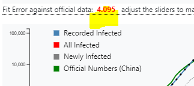
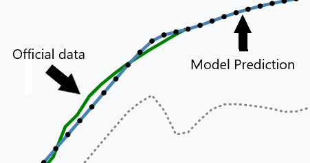

# CoronaVirus Modeler Updates / News
*Nurul Choudhury*  

## Update 2020-02-13

Big surge in officail data from China, this is a result of changes in reporting. Previously only verified results through 

## Update 2020-02-07

## Official Count

*2020-02-05*  **31481**
The model predicted tracking accurately with any parameter adjustments.

## Update 2020-02-06

### Official Count

*2020-02-05*  **28365**
The model predicted this value without any changes to the parameters. This suggests that the model is tracking accurately.

## Update 2020-02-05

As new data arrives I have been updating the model parameters (the actual model is unchanged).

| Key | Value |
| ----- | ------- |
| initial | 63 |
| daysOfSickness | 20 |
| becomeSpreader | 4 |
| daysAsSpreader | 6 |
| symptomsAppear | 9 |
| infectPerDay | 2.03 |
| percentRecorded |0.02|
| lockdown | 28 |
| spreadReduction | 0.9 |
| administrativeDelay | 2 |
| dateAdjust | 33 |

### Official Count

*2020-02-04*  **24,641**

It seems that affect of the lockdown is significantly weaker that previously seen as we get new data. Originall it appeared that the lockdown 
had reduced the rate of spread of the virus by 98% (0.98 values  for *spreadReduction*). But as per the latest infection data published by China CDC, 
the lockdown reduction rate had to be revised down to 90%.  The method for determining the best fit is to look at the error value and adjust parameters until that value is minimized. 

The other thing to consider is the slope of the officil data  and the simulation data. The slopes should closely match.

This optimization currently has to be done manually adjusting the sliders. In the newr future I am hoping to add a button to do this optimization automatically.
The standard method for doing this is called gradient descent, a technique employed by neural networks to optimize its the network weights (parameters).
